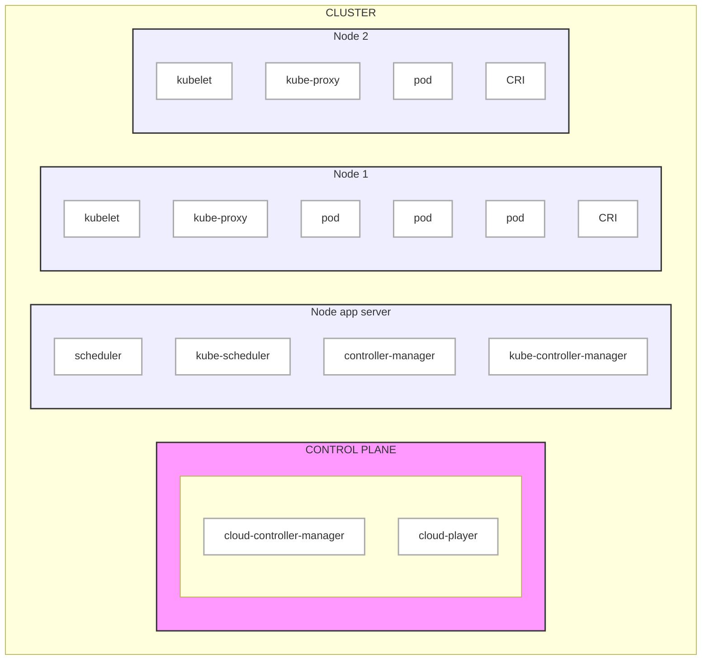
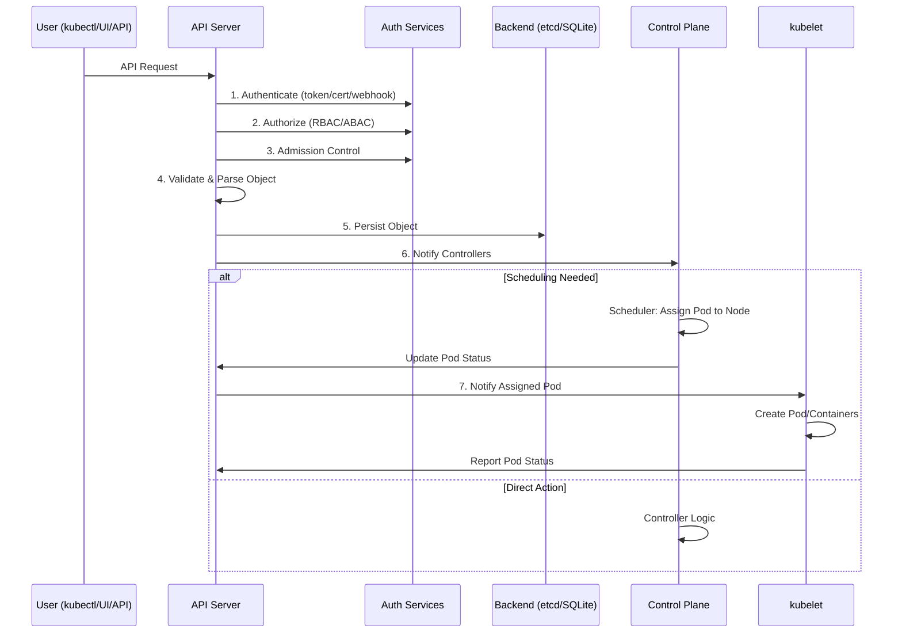
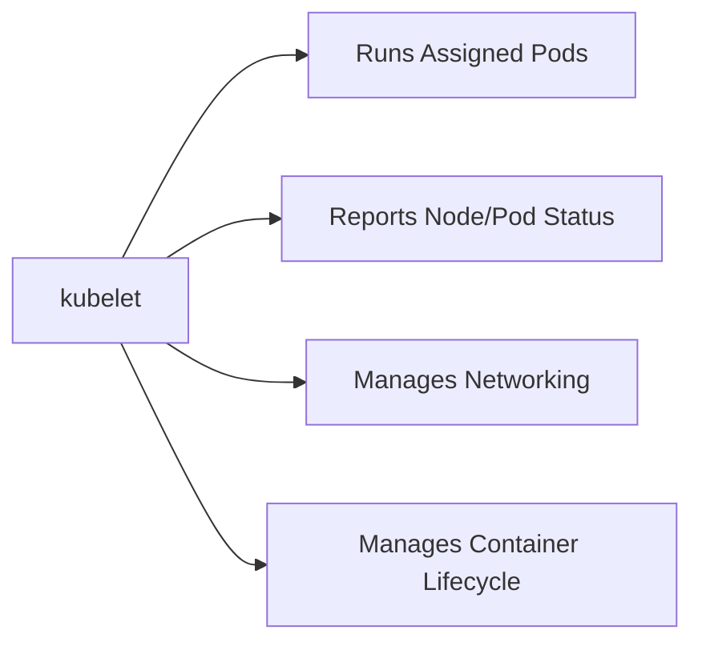

## Kubernetes Architecture: Manager & Worker Node

#### 1️⃣ Manager Node (Control Plane)

----------------------------

This node controls and manages the entire Kubernetes cluster.

| Component                 | Description                                               |
| ------------------------- | --------------------------------------------------------- |
| `kube-apiserver`          | Central API server for communication (kubectl uses this). |
| `etcd`                    | Key-value store for cluster state/configuration.          |
| `kube-scheduler`          | Assigns new Pods to available nodes.                      |
| `kube-controller-manager` | Handles replication, node health, and other controllers.  |
| `containerd`              | Container runtime that actually runs the containers.      |

##### ✅ Responsibilities

Accepts and validates cluster commands (kubectl)

Schedules Pods to Worker nodes

Monitors cluster health

Stores and updates cluster state/config in etcd
#### 2️⃣ Worker Node

------------------------

This node runs your actual applications (containers).

| Component    | Description                                                       |
| ------------ | ----------------------------------------------------------------- |
| `kubelet`    | Talks to the Manager node; ensures containers (pods) are running. |
| `kube-proxy` | Manages networking for Pods and Services.                         |
| `containerd` | Executes and manages containers.                                  |

##### ✅ Responsibilities

Runs Pods assigned by the Manager

Reports node and pod status to the Control Plane

Manages networking and container lifecycle

------------------------------------------------------

### 🔄 Kubernetes API Server Request Sequence

**Key Components Explained:**

1.Authentication: Verifies user credentials

2.Authorization: Checks permissions (RBAC/ABAC)

3.Admission Control: Validates/modifies requests

4.Validation: Ensures object schema correctness

5.Persistence: Stores state in etcd/SQLite

6.Control Plane: Handles controllers/scheduling

7.kubelet: Creates containers and reports status

-----------------------------------------------

#### 🔄 Responsibilities Summary:

📘 ***Documentation***

For complete Kubernetes guides and reference materials, visit the [official Kubernetes documentation](https://kubernetes.io/docs/).

