### Kubernetes Architecture: Control Plane & Worker Nodes

#### 🧠 Control Plane (Manager Node)
Controls and manages the entire Kubernetes cluster

| Component                 | Description                                               |
| ------------------------- | --------------------------------------------------------- |
| `kube-apiserver`          | Central API server for communication (kubectl uses this) |
| `etcd`                    | Key-value store for cluster state/configuration          |
| `kube-scheduler`          | Assigns new Pods to available nodes                      |
| `kube-controller-manager` | Handles replication, node health, and controllers        |
| `containerd`              | Container runtime that runs control plane containers     |

**✅ Control Plane Responsibilities**
- Accepts and validates cluster commands (kubectl)
- Schedules Pods to Worker nodes
- Monitors cluster health
- Stores/updates cluster state in etcd

**⚙️ Worker Nodes**

Run application workloads in containers

| Component    | Description                                                       |
| ------------ | ----------------------------------------------------------------- |
| `kubelet`    | Ensures containers (pods) are running as specified               |
| `kube-proxy` | Manages networking for Pods and Services                         |
| `containerd` | Executes and manages application containers                      |

#### ✅ Worker Node Responsibilities
- Runs Pods assigned by Control Plane
- Reports node/pod status to Control Plane
- Manages container lifecycle
- Handles pod networking

---

#### 📊 Cluster Architecture Overview

-------------------------------------------

#### 🔄 API Server Request Flow

```mermaid
sequenceDiagram
    autonumber
    participant User as User (kubectl/UI/API)
    participant API as API Server
    participant Auth as Auth Services
    participant etcd as etcd
    participant Scheduler
    participant Kubelet
    
    User->>API: ① API Request
    API->>Auth: ② Authenticate
    API->>Auth: ③ Authorize (RBAC)
    API->>Auth: ④ Admission Control
    API->>API: ⑤ Validate & Parse
    API->>etcd: ⑥ Persist to Storage
    API->>Scheduler: ⑦ Notify Scheduler
    Scheduler->>API: ⑧ Assign Node
    API->>Kubelet: ⑨ Create Pod
    Kubelet->>Kubelet: ⑩ Start Containers
    Kubelet->>API: ⑪ Report Status
```

--------------------------------------

#### 🛠️ kubelet Responsibilities

